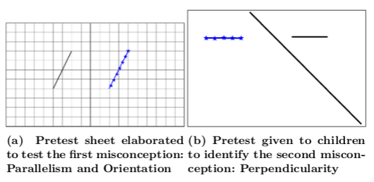
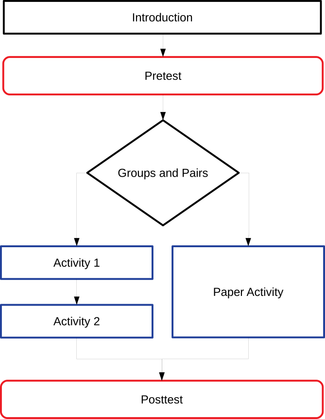
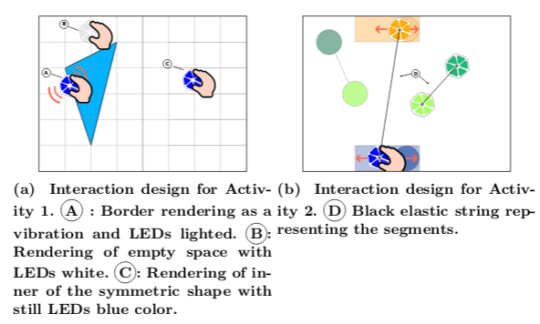
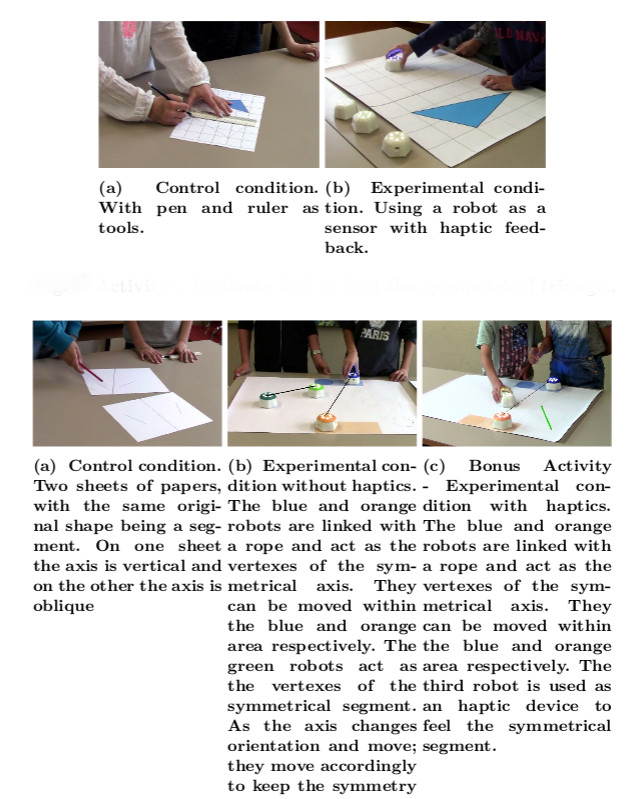

# Cellulo-Symmetry-Material
Give access to the material used in an experiment that used the Cellulo robots to teach Symmetry

## Misconceptions

## Experiment Workflow

## Map and Interaction Design

## Learning activities

